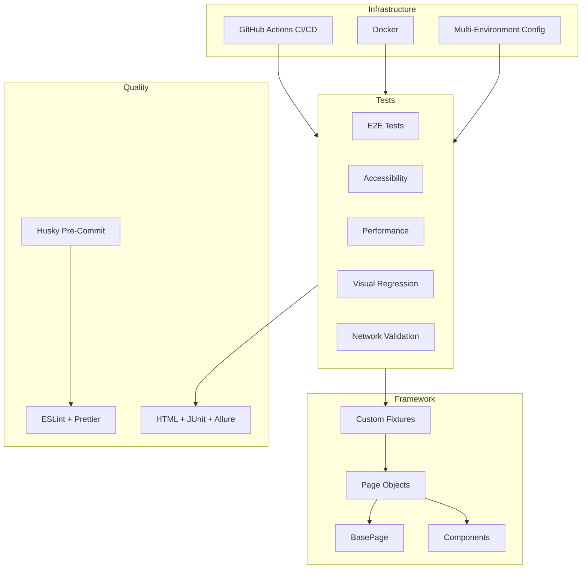

# Playwright Enterprise Framework

A production-ready Playwright automation framework demonstrating enterprise-level QA engineering practices -- targeting [SauceDemo](https://www.saucedemo.com).

[](https://github.com/mustafaautomation/playwright-enterprise-framework/actions/workflows/regression.yml)
[](https://github.com/mustafaautomation/playwright-enterprise-framework/actions/workflows/smoke.yml)
[](LICENSE)
[](https://playwright.dev)
[](https://www.typescriptlang.org)
[](https://nodejs.org)
[](Dockerfile)

---

## Table of Contents

- [Overview](#overview)
- [Demo](#demo)
- [Architecture](#architecture)
- [Tech Stack](#tech-stack)
- [Project Structure](#project-structure)
- [Quick Start](#quick-start)
- [Scripts](#scripts)
- [Test Coverage](#test-coverage)
- [Environment Variables](#environment-variables)
- [CI/CD](#cicd)
- [Docker](#docker)

---

## Overview

This framework mirrors how production QA automation infrastructure is built at scale. Key outcomes:

- **53 unique test cases** across 8 browser projects, producing 159 test runs per full execution
- **Zero repeated logins** -- auth state saved once via `global.setup.ts`, reused across all tests
- **Cross-browser coverage** -- Chromium, Firefox, WebKit, and Mobile Chrome
- **CI/CD pipeline** -- smoke on PRs, full regression on merge and nightly schedule
- **Enterprise patterns** -- POM architecture, custom fixtures, data-driven tests, network validation
- **Code quality gates** -- ESLint + Prettier enforced via Husky pre-commit hooks and CI checks

---

## Demo

```
$ npm run test:smoke

Running 8 tests using 4 workers

  ✓  [auth-tests] › auth/login.spec.ts › should login successfully with valid credentials @smoke (1.5s)
  ✓  [auth-tests] › multi-user/multi-user.spec.ts › standard user should see 6 products @smoke (1.6s)
  ✓  [chromium] › cart/cart.spec.ts › should display all added items @smoke (1.6s)
  ✓  [chromium] › inventory/inventory.spec.ts › should display 6 products @smoke (535ms)
  ✓  [auth-tests] › auth/login.spec.ts › should logout successfully @smoke (2.4s)
  ✓  [chromium] › inventory/inventory.spec.ts › should add a product to cart @smoke (579ms)
  ✓  [chromium] › cart/cart.spec.ts › should navigate to checkout step one @smoke (786ms)
  ✓  [chromium] › checkout/checkout.spec.ts › should complete full checkout flow @smoke (966ms)

  8 passed (7.6s)


$ npm run test:regression

Running 86 tests using 4 workers
  ...
  86 passed (41.6s)


$ npx playwright test --project=a11y --project=performance

  ✓  [a11y] › accessibility.spec.ts › login page — no critical a11y violations (1.5s)
  ✓  [a11y] › accessibility.spec.ts › inventory page — no critical a11y violations (1.7s)
  ✓  [a11y] › accessibility.spec.ts › cart page — no critical a11y violations (1.8s)
  ✓  [a11y] › accessibility.spec.ts › checkout page — no critical a11y violations (1.8s)
  ✓  [performance] › web-vitals.spec.ts › inventory page meets performance budgets (530ms)
  ✓  [performance] › web-vitals.spec.ts › login page meets performance budgets (475ms)

  6 passed (5.3s)
```

> **53 unique test cases** producing **159 runs** across Chromium, Firefox, WebKit, and Mobile Chrome -- plus dedicated a11y, performance, and visual regression suites.

---

## Architecture



### Auth State Management

`global.setup.ts` authenticates once and saves browser storage state. All non-auth tests reuse this state -- zero repeated logins, faster execution, no flaky auth flows.

### Page Object Model

Every page is a TypeScript class extending `BasePage`. No raw selectors in test files. Locators live in the POM; tests describe behaviour. Components like `Header` are shared across pages.

### Custom Fixtures

Page objects are injected via Playwright's fixture system. Tests declare what they need (`loginPage`, `cartPage`, `header`, etc.); the framework wires it up.

### Pre-Commit Quality Gate

Husky + lint-staged enforces code quality on every commit. Pre-commit hooks run Prettier formatting and ESLint checks on staged `.ts` files. Auth state files (`.auth/`) and `.env` variants are blocked from being committed.

### Multi-Environment Support

Switch between production and staging with `TEST_ENV=staging`. Environment config is centralized in `config/env.ts` with `.env` file support.

### Test Projects (8 configured)

| Project | Purpose |
|---|---|
| `auth-tests` | Login/logout + multi-user (no saved state) |
| `chromium` | Cross-browser: Chrome |
| `firefox` | Cross-browser: Firefox |
| `webkit` | Cross-browser: Safari |
| `mobile-chrome` | Responsive: Pixel 5 |
| `visual` | Visual regression snapshots |
| `a11y` | Accessibility audits |
| `performance` | Performance budget checks |

### Data-Driven Testing

Product data lives in `src/data/products.ts`. Parameterized tests iterate over all products, generating one test case per product automatically.

### Network & API Validation

Tests intercept HTTP responses to detect failed API calls, broken images (excluding browser-initiated manifest/favicon requests), and measure page load performance.

---

## Tech Stack

| Layer | Technology |
|---|---|
| Framework | [Playwright](https://playwright.dev) 1.44+ |
| Language | TypeScript 5 (strict mode) |
| Pattern | Page Object Model (POM) |
| Accessibility | [axe-core](https://github.com/dequelabs/axe-core) (WCAG 2.0 AA) |
| Reporting | Playwright HTML + JUnit + Allure |
| Code Quality | ESLint + Prettier |
| Git Hooks | Husky + lint-staged (pre-commit quality gate) |
| CI/CD | GitHub Actions (smoke + regression) |
| Containerization | Docker + docker-compose |

---

## Project Structure

```
playwright-enterprise-framework/
├── .github/
│   ├── workflows/
│   │   ├── smoke.yml                # PR → Chromium smoke tests
│   │   └── regression.yml           # Merge/nightly → full cross-browser
│   ├── dependabot.yml               # Automated dependency updates
│   ├── CODEOWNERS                   # Review ownership rules
│   └── pull_request_template.md     # PR checklist template
├── config/
│   └── env.ts                       # Multi-environment config (prod/staging)
├── src/
│   ├── pages/                       # Page Object Models
│   │   ├── BasePage.ts              # Abstract base with shared navigation
│   │   ├── LoginPage.ts
│   │   ├── InventoryPage.ts
│   │   ├── ProductDetailPage.ts
│   │   ├── CartPage.ts
│   │   └── CheckoutPage.ts
│   ├── components/
│   │   └── Header.ts                # Shared header component (cart, menu)
│   ├── fixtures/
│   │   └── index.ts                 # Custom Playwright fixtures
│   ├── utils/
│   │   ├── helpers.ts               # Random data generators
│   │   └── performance.ts           # Web Vitals collection
│   └── data/
│       ├── users.ts                 # Multi-user test data
│       └── products.ts              # Product constants
├── tests/
│   ├── e2e/
│   │   ├── auth/                    # Login / logout (no saved state)
│   │   ├── inventory/               # Product listing + sorting
│   │   ├── product-detail/          # Product detail page
│   │   ├── cart/                    # Cart management
│   │   ├── checkout/                # Full purchase flow
│   │   ├── multi-user/              # Cross-user scenario testing
│   │   ├── data-driven/             # Parameterized product tests
│   │   └── network/                 # API/network validation
│   ├── a11y/                        # axe-core accessibility audits
│   ├── performance/                 # Web Vitals budgets
│   └── visual/                      # Visual regression snapshots
├── CONTRIBUTING.md                  # How to add tests and contribute
├── SECURITY.md                      # Vulnerability disclosure policy
├── Dockerfile                       # Containerized test execution
├── docker-compose.yml
├── global.setup.ts                  # One-time auth state bootstrap
└── playwright.config.ts             # 8 test projects configured
```

---

## Quick Start

```bash
# Clone
git clone https://github.com/mustafaautomation/playwright-enterprise-framework.git
cd playwright-enterprise-framework

# Install
npm install
npx playwright install

# Configure — fill in your credentials
cp .env.example .env

# Run all tests
npm test

# Smoke tests only
npm run test:smoke

# Open interactive UI mode
npm run test:ui
```

---

## Scripts

| Command | Description |
|---|---|
| `npm test` | Full suite -- all browsers |
| `npm run test:smoke` | Critical paths only (`@smoke`) |
| `npm run test:regression` | Full regression (`@regression`) |
| `npm run test:chromium` | Chromium only |
| `npm run test:firefox` | Firefox only |
| `npm run test:webkit` | WebKit only |
| `npm run test:a11y` | Accessibility audits |
| `npm run test:perf` | Performance budget checks |
| `npm run test:visual` | Visual regression snapshots |
| `npm run test:visual:update` | Update visual baselines |
| `npm run test:data` | Data-driven product tests |
| `npm run test:network` | API/network validation |
| `npm run test:headed` | Run with visible browser |
| `npm run test:debug` | Debug with Playwright Inspector |
| `npm run lint` | ESLint check |
| `npm run lint:fix` | ESLint auto-fix |
| `npm run format` | Prettier format all files |
| `npm run format:check` | Prettier check (CI) |
| `npm run docker:test` | Run full suite in Docker |
| `npm run docker:smoke` | Run smoke tests in Docker |
| `npm run report` | Open last HTML report |

---

## Test Coverage

| Area | Tests | Tags |
|---|---|---|
| Authentication | Login, logout, error states, locked users | `@smoke` `@regression` |
| Inventory | Product count, names, sorting (4 modes), cart add/remove | `@smoke` `@regression` |
| Product Detail | Detail display, cart add/remove from PDP, navigation, images | `@regression` |
| Cart | Item display, price validation, remove, navigation | `@smoke` `@regression` |
| Checkout | Full flow, order total, field validation, back to products | `@smoke` `@regression` |
| Multi-User | Problem user glitches, perf user timing, locked user denial | `@regression` |
| Data-Driven | Parameterized tests for all 6 products | `@regression` |
| Network | Failed API detection, broken image detection, performance tracking | `@regression` |
| Accessibility | axe-core WCAG 2.0 AA audits across 4 pages | `@a11y` `@regression` |
| Performance | TTFB, FCP, DOM Content Loaded, Load Complete budgets | `@performance` `@regression` |
| Visual | Pixel-diff snapshot comparisons for key pages | `@visual` |

---

## Environment Variables

| Variable | Default | Description |
|---|---|---|
| `BASE_URL` | `https://www.saucedemo.com` | Target application |
| `TEST_ENV` | `production` | Environment (`production` / `staging`) |
| `STANDARD_USER` | `standard_user` | Primary test user |
| `PASSWORD` | *(required)* | Test user password |
| `LOCKED_USER` | `locked_out_user` | Locked account (negative testing) |
| `PROBLEM_USER` | `problem_user` | Buggy UI user (glitch testing) |
| `PERF_USER` | `performance_glitch_user` | Slow response user |

---

## CI/CD

- **Smoke pipeline** -- fires on every PR, runs lint + format checks, then `@smoke` tests on Chromium
- **Regression pipeline** -- fires on push to `main` and nightly at midnight UTC, runs full cross-browser suite
- **Quality gates** -- ESLint + Prettier checks run before tests in both pipelines
- **Dependency updates** -- Dependabot keeps Playwright, ESLint, and Actions up to date weekly
- **Least-privilege** -- workflow tokens scoped to `contents: read`
- **Artifacts**: HTML reports (30 days), JUnit XML (30 days), test results on failure (7 days)

---

## Docker

```bash
# Run full test suite in Docker
PASSWORD=secret_sauce npm run docker:test

# Run smoke tests in Docker
PASSWORD=secret_sauce npm run docker:smoke
```

> Note: `PASSWORD` env var is required. Docker will not run with a fallback default.

---

Built by [Quvantic](https://quvantic.com)
